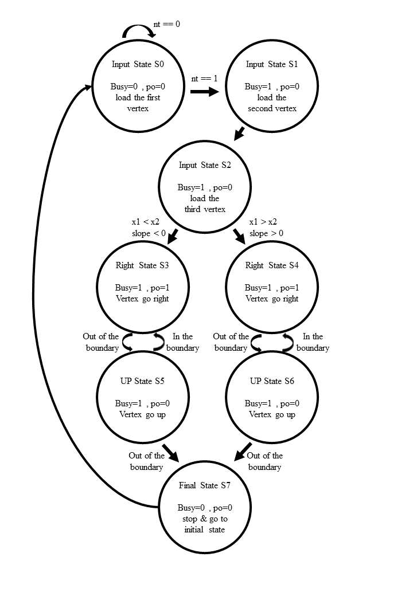

## FPGA-based System Design - Lab00 HW

## 成員名單
E24056027 洪偉庭

E24056726 高士鈞

E24056483 謝明穎

## 問題描述
請完成一直角三角形(Right-angled triangle)之直角座標轉譯系統(Rendering Engine)。

此直角三角形之座標轉譯系統，將可於testbench所提供的直角三角形的三個頂點座標如(x1,y1)、(x2,y2)與(x3,y3)後，

轉譯系統將依序完成涵蓋於直角三角形平面內的所有座標點之輸出。

## 設計說明

在取得三個輸入的頂點後，判斷直角三角形斜邊斜率的正負，進到左右兩條相應的state

輸出頂點由左到右，右下而上，依序輸出，直到跑出邊界。

## FSM State Diagram

## 模擬結果圖
### 測試檔1

## 模擬波形圖
### 測試檔1

