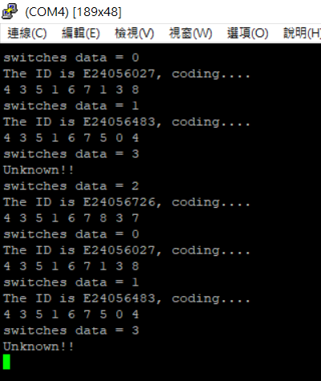
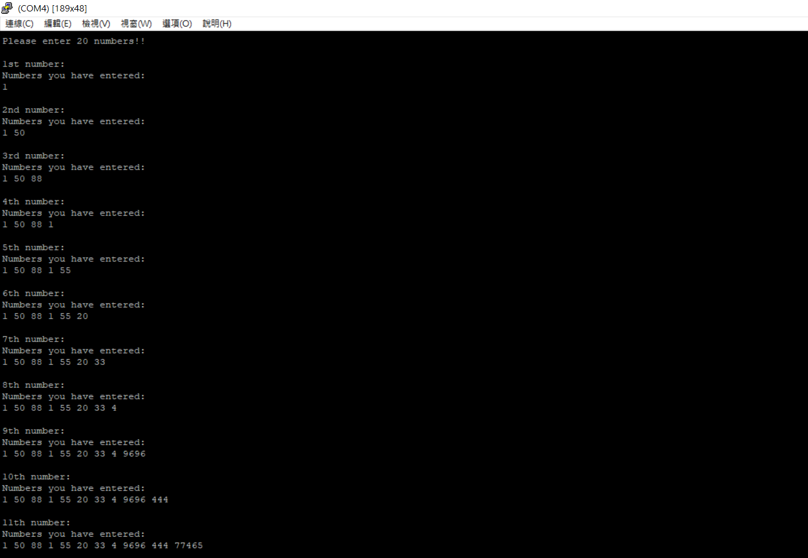
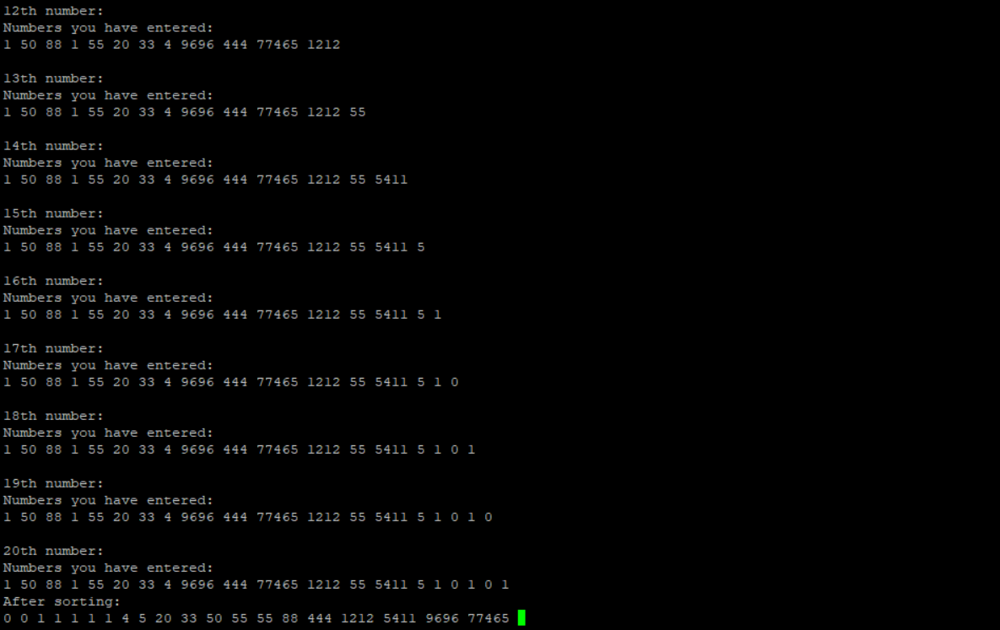

# FPGA-based System Design - Lab03 HW

成員名單
---
E24056027 洪偉庭  
E24056726 高士鈞  
E24056483 謝明穎  

Question 1
--
## 問題
請問在不改動任何設定下，ZYNQ CPU 儲存資料的方式是 big-endian 還是 little-endian?

## 解答
little-endian, 根據PYNQ-Z2 User Manual中提到:

"The
OTP address range [0x20;0x25] contains the identifier with the  first byte in
transmission byte order being at the lowest address."

這就是little-endian的概念!

Program 1 : 使用 AXI GPIO - 控制 RGB LED
--
## 作業說明
使用3個AXI GPIO分別輸出RGB的LED信號，並利用processor處理速度模擬假clk，來完成每隔一段時間輸出訊號的目的。

## 結果
實際燒錄FPGA即可，就不附圖了

Porgram 2 : Hash Function
--
## 作業說明
利用 [這裡](https://stackoverflow.com/questions/20462826/hash-function-for-strings-in-c) 所找到的Hash function來解碼，但並未考慮collision的問題。Switch訊號控制的寫法就跟Lab3-2的 C code類似，就不在此贅述。
(有額外利用for迴圈造成延遲來避免切換按鈕中間訊號輸入的灰色地帶)

## 結果

Program 3 : Sorting
--
## 作業說明
利用 Quick Sort來排序

## 結果

