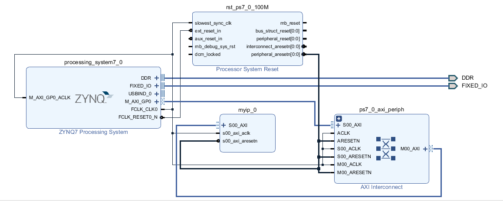
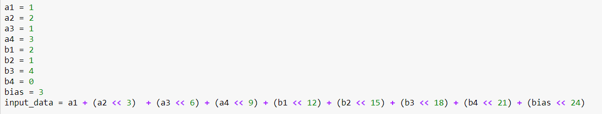
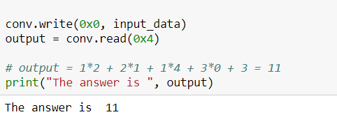

# FPGA-based System Design - Lab06 HW

成員名單
---
E24056027 洪偉庭  
E24056726 高士鈞  
E24056483 謝明穎  

## Program 1 : 設計一個2*2的卷積運算處理器
### Block Design

### IP introduce
AXI IP 名為 myip_0

卷積運算寫於conv.v

資料皆為純整數(0~7)

卷積器資料與結果由 AXI Register 存取

存取方式同Lab6-2 將input資料整合到slv_reg0，output 存至 offset 為 4 的位置

### HW result
input如下圖:

a1~4 為 input feature map的四個值

b1~4 為 filter 的四個值

bias 顧名思義

output結果如下圖:

